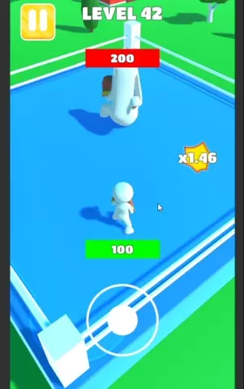

# royal-punch-unity-clone
 
## Description

Unity developer position assessment task

https://play.google.com/store/apps/details?id=royal.punch.box

```
Все ассеты для Royal Punch. Полностью скопировать игру, в т.ч. окружение, управление, поведение, супер-атаки, эффекты и прочее.

Акцент - механика боя, партиклы, супер-удары, рэгдолл, поднятие из рэгдолла (через код, подсказка - запись костей. Вариант проще - как в Hit Masters 3D), области атаки (через шейдер Field of View, с настройкой радиуса атаки), отталкивание персонажа при получении урона от супер-удара, хп бары, поворот камеры при старте.

Уточняю, что за этот срок цель не сделать проект, а показать то, что будет готово
```
## Showcase

<table>
  <tr>
    <td>
      
    </td>
  </tr>
  <tr>
    <td>
      
    </td>
  </tr>
</table>
